# Token Presale Foundry


**基于Foundry开发的去中心化代币预售智能合约系统，支持ETH捐赠、USD价格转换、代币线性解锁和紧急暂停功能。**

## 📌 目录

- [快速开始](#快速开始)
- [项目概述](#项目概述)
- [功能特点](#功能特点)
- [技术架构](#技术架构)
- [安装指南](#安装指南)
- [测试策略](#测试策略)
- [部署指南](#部署指南)
- [合约交互](#合约交互)
- [安全考量](#安全考量)
- [贡献指南](#贡献指南)
- [许可证](#许可证)

## 🚀 快速开始

按照以下步骤快速启动项目：

1. **克隆仓库**
   ```bash
   git clone https://github.com/[username]/token-presale-foundry.git
   cd token-presale-foundry
   ```

2. **配置环境变量**
   - 创建`.env`文件
   ```bash
   cp .env.example .env
   ```
   - 编辑`.env`文件，配置必要的变量：
   ```
   # RPC URLs
   SEPOLIA_RPC_URL=https://sepolia.infura.io/v3/YOUR_API_KEY
   MAINNET_RPC_URL=https://mainnet.infura.io/v3/YOUR_API_KEY
   
   # 部署钱包
   PRIVATE_KEY=your_private_key
   MYWALLET_ADDRESS=your_wallet_address
   
   # API Keys (如需验证合约)
   ETHERSCAN_API_KEY=your_etherscan_api_key
   ```

3. **构建项目**
   ```bash
   make build
   ```

4. **启动本地测试链**
   ```bash
   make anvil
   ```

5. **部署合约**
   - 打开新终端，查看可用命令
   ```bash
   make help
   ```
   - 根据提示部署到不同网络：
     - 本地部署：`make deploy-anvil`
     - Sepolia测试网：`make deploy-sepolia`

6. **启动前端服务**
   - 打开新终端，运行Python简单服务器：
   ```bash
   python3 -m http.server 8000
   ```
   - 在浏览器中访问: [http://localhost:8000](http://localhost:8000)
   - 根据`README-frontend.md`中的说明使用前端界面

### 💡 重要提示

- **关于提取ETH功能**：执行`withdrawETH`函数时，这是一个内部交易(Internal Transaction)，交易本身的value为0，钱包交易记录只会显示"已确认"状态，不会显示实际转移的ETH金额。
- 如需查看实际转移的ETH，请在相应的区块链浏览器(如Etherscan)上使用交易哈希查找交易详情，并查看"Internal Txns"标签页。
- 这是正常行为，因为资金转移发生在合约内部调用过程中，而不是直接通过交易value字段。

## 🌟 项目概述

Token Presale Foundry 是一个完整的代币预售解决方案，允许项目方通过智能合约进行去中心化的代币预售。用户可以使用ETH参与预售，系统自动使用Chainlink预言机将ETH转换为等值USD，并在预售结束后按照设定比例线性释放代币给参与者。

### 核心场景

1. **用户参与预售**：用户发送ETH到合约参与预售
2. **价格实时转换**：使用Chainlink预言机将ETH转换为USD价值
3. **项目方提现**：当达到目标金额或时间结束时，项目方可提现ETH
4. **线性解锁代币**：代币在一段时间内线性解锁，用户可按比例领取
5. **紧急暂停机制**：项目方可在发现问题时暂停预售，保护用户资金

## 🔥 功能特点

### 用户功能
- **ETH捐赠参与**：用户发送ETH即可自动参与预售
- **代币线性解锁**：代币在24小时内线性解锁，保护用户权益
- **自动代币计算**：基于USD贡献自动计算用户应得代币
- **便捷查询功能**：一键查询已贡献金额、可领取代币和已领取代币

### 项目方功能
- **募资目标设置**：预设USD目标金额（50 USD）
- **时间限制控制**：预设预售时长（30分钟）
- **紧急暂停机制**：可在异常情况下暂停预售
- **安全提现功能**：达到目标或时间结束后可提现ETH

### 技术特点
- **实时价格转换**：通过Chainlink预言机实时转换ETH/USD价格
- **容错机制**：支持价格波动容差（0.01 USD）
- **Fall back & receive**：支持直接发送ETH参与预售
- **事件通知**：关键操作触发事件通知

## 🔧 技术架构

### 智能合约架构

```mermaid
graph TD
    A[用户] -->|捐赠ETH| B[TokenPresale]
    B -->|查询ETH/USD价格| C[PriceConverter]
    C -->|调用价格预言机| D[Chainlink Oracle]
    D -->|返回ETH/USD价格| C
    C -->|返回USD价值| B
    B -->|记录用户贡献| E[状态存储]
    F[项目方] -->|提现ETH| B
    F -->|暂停/恢复| B
    A -->|领取代币| B
    B -->|计算可领取代币| G[线性释放逻辑]
```



### 核心合约

1. **TokenPresale.sol**
   - 主合约，负责预售功能、资金管理和代币分配
   - 实现紧急暂停、代币线性解锁和用户贡献记录

2. **PriceConverter.sol**
   - 辅助库，封装与Chainlink预言机的交互
   - 提供ETH到USD的价格转换功能

3. **MockV3Aggregator.sol** (仅测试使用)
   - 模拟Chainlink价格预言机功能
   - 用于单元测试和集成测试

## ⚙️ 安装指南

### 前提条件

- [Foundry](https://getfoundry.sh/) 工具链
- [Git](https://git-scm.com/downloads)

### 克隆仓库

```bash
git clone https://github.com/[your-username]/token-presale-foundry.git
cd token-presale-foundry
```

### 安装依赖

```bash
forge install
```

### 编译合约

```bash
forge build --via-ir --optimize
```

## 🧪 测试策略

本项目采用多维度测试策略，确保合约的安全性和功能正确性：

### 1. 单元测试 (Unit Tests)

测试单个合约功能，使用模拟的外部依赖。

```bash
# 运行单元测试
forge test --match-path test/unit/TokenPresaleTest_Unit.t.sol -v
```

**主要测试内容**：
- 贡献ETH功能和边界条件
- 代币计算和线性解锁逻辑
- 项目方权限和提现功能
- 紧急暂停机制
- Fallback和Receive函数

### 2. 集成测试 (Integration Tests)

测试多个合约组件之间的交互，验证完整业务流程。

```bash
# 运行集成测试
forge test --match-path test/integration/TokenPresaleTest_Integration.t.sol -v
```

**主要测试内容**：
- 完整预售周期（捐赠→提现→计算代币→线性解锁→领取）
- 紧急暂停对整个流程的影响
- 不同价格环境下的预售流程
- 用户信息查询功能

### 3. 分叉测试 (Forked Tests)

在真实网络的快照上测试合约，特别是与外部服务的交互。

```bash
# 运行分叉测试 (需要RPC URL)
forge test --match-path test/forked/TokenPresaleTest_Forked.t.sol --fork-url $SEPOLIA_RPC_URL -v
```

**主要测试内容**：
- 真实Chainlink预言机的价格转换
- 在实际网络条件下的合约行为
- 价格波动对预售的影响

### 4. 阶段测试 (Staging Tests)

在部署前，模拟生产环境进行最终验证。

```bash
# 运行阶段测试 (需要主网RPC URL)
forge test --match-path test/staging/TokenPresaleTest_Staging.t.sol --fork-url $MAINNET_RPC_URL -v
```

**主要测试内容**：
- 多用户参与的预售场景
- 在主网环境中的完整业务流程
- 极端情况下的紧急处理

### 运行全部测试

使用脚本一键运行所有测试：

```bash
./script/RunTests.sh
```

## 🚀 部署指南

### 环境配置

1. 创建`.env`文件并设置以下环境变量：

```
# RPC URLs
SEPOLIA_RPC_URL=https://sepolia.infura.io/v3/YOUR_API_KEY
MAINNET_RPC_URL=https://mainnet.infura.io/v3/YOUR_API_KEY
RPC_URL=http://localhost:8545

# 部署钱包
PRIVATE_KEY=your_private_key
MYWALLET_ADDRESS=your_wallet_address

# API Keys
ETHERSCAN_API_KEY=your_etherscan_api_key
```

2. 加载环境变量：

```bash
source .env
```

### 本地部署 (Anvil)

```bash
# 启动本地节点
anvil

# 部署合约
forge create src/TokenPresale.sol:TokenPresale \
  --from $MYWALLET_ADDRESS \
  --rpc-url http://127.0.0.1:8545 \
  --private-key $PRIVATE_KEY \
  --legacy \
  -vvv
```

### 测试网部署 (Sepolia)

```bash
# 使用脚本部署
forge script script/DeployTokenPresale.s.sol:DeployTokenPresale \
  --rpc-url $SEPOLIA_RPC_URL \
  --private-key $PRIVATE_KEY \
  --broadcast \
  --verify \
  --etherscan-api-key $ETHERSCAN_API_KEY \
  -vvv

# 或者直接部署
forge create src/TokenPresale.sol:TokenPresale \
  --rpc-url $SEPOLIA_RPC_URL \
  --private-key $PRIVATE_KEY \
  --verify \
  --etherscan-api-key $ETHERSCAN_API_KEY \
  --legacy \
  -vvv
```

## 💼 合约交互

部署后，可以使用以下方法与合约交互：

### 使用Cast命令行工具

```bash
# 查询预售结束时间
cast call $CONTRACT_ADDRESS "presaleEndTime()" --rpc-url $RPC_URL

# 参与预售
cast send $CONTRACT_ADDRESS "fund()" --value 0.01ether --from $YOUR_ADDRESS --private-key $YOUR_PRIVATE_KEY --rpc-url $RPC_URL

# 提取ETH (仅项目方)
cast send $CONTRACT_ADDRESS "withdrawETH()" --from $OWNER_ADDRESS --private-key $OWNER_PRIVATE_KEY --rpc-url $RPC_URL

# 领取代币
cast send $CONTRACT_ADDRESS "claimTokens()" --from $YOUR_ADDRESS --private-key $YOUR_PRIVATE_KEY --rpc-url $RPC_URL

# 查询用户信息
cast call $CONTRACT_ADDRESS "getUserInfo(address)" $YOUR_ADDRESS --rpc-url $RPC_URL
```

### 使用前端应用

如需集成到前端应用，可以使用ethers.js或web3.js库：

```javascript
// 使用ethers.js示例
const { ethers } = require("ethers");
const provider = new ethers.providers.JsonRpcProvider(RPC_URL);
const signer = new ethers.Wallet(PRIVATE_KEY, provider);
const contractABI = [...]; // 合约ABI
const contractAddress = "0x..."; // 合约地址
const tokenPresale = new ethers.Contract(contractAddress, contractABI, signer);

// 参与预售
const tx = await tokenPresale.fund({ value: ethers.utils.parseEther("0.01") });
await tx.wait();

// 查询用户信息
const userInfo = await tokenPresale.getUserInfo(userAddress);
console.log({
  contributed: ethers.utils.formatUnits(userInfo[0], 0),
  claimed: userInfo[1].toString(),
  claimable: userInfo[2].toString()
});
```

## 🔒 安全考量

本项目实现了多重安全机制，但在生产环境使用前，请注意以下安全事项：

1. **预言机依赖**：合约依赖Chainlink预言机获取ETH/USD价格，如果预言机故障或被操纵，可能影响预售
2. **紧急暂停**：项目方拥有暂停合约的权限，确保项目方可信
3. **价格波动**：ETH价格波动可能影响用户参与预售的美元价值计算
4. **线性解锁**：代币在24小时内线性解锁，防止立即抛售
5. **整数溢出保护**：使用Solidity 0.8版本，内置整数溢出保护

建议在主网部署前进行专业的安全审计。

## 🤝 贡献指南

欢迎贡献代码、报告问题或提出改进建议！

1. Fork本仓库
2. 创建功能分支 (`git checkout -b feature/amazing-feature`)
3. 提交更改 (`git commit -m 'Add amazing feature'`)
4. 推送分支 (`git push origin feature/amazing-feature`)
5. 创建Pull Request

## 📄 许可证

本项目采用MIT许可证。详情请参阅 [LICENSE](LICENSE) 文件。

---

## 📚 Foundry文档

更多关于Foundry的信息，请参阅官方文档：[Foundry Book](https://book.getfoundry.sh/)
